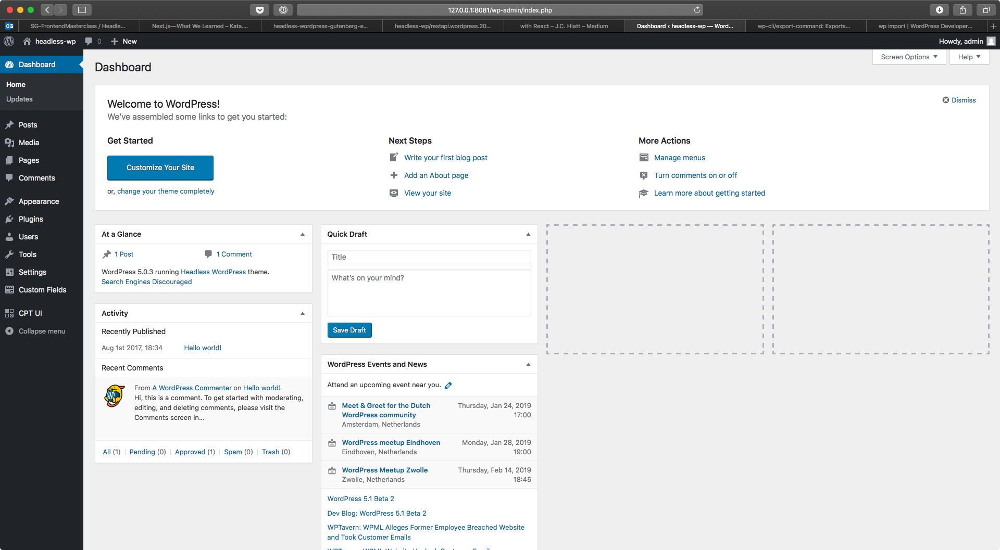
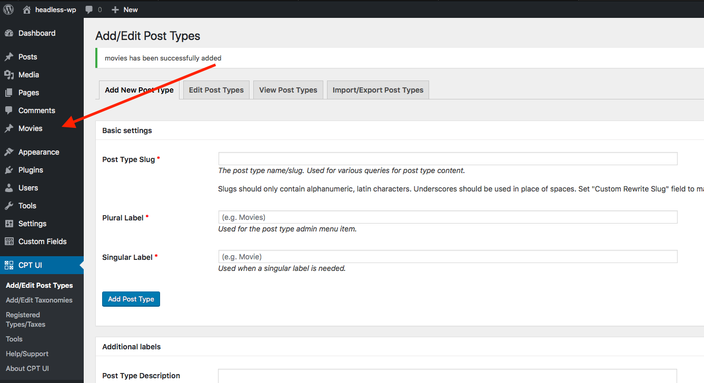

# Headless WordPress with react

## What's inside

- A WordPress installation with:
  - [Gutenberg](https://wordpress.org/gutenberg/), WordPress' next-generation post editor
  - [Advanced Custom Fields](https://www.advancedcustomfields.com/) and [Custom Post Type UI](https://wordpress.org/plugins/custom-post-type-ui/).
  - Plugins which expose ACF fields and WordPress menus in the [WP REST API](https://developer.wordpress.org/rest-api/) ([ACF to WP API](https://wordpress.org/plugins/acf-to-wp-api/) and [WP-REST-API V2 Menus](https://wordpress.org/plugins/wp-rest-api-v2-menus/)).
  - All the starter WordPress theme code and settings headless requires, including pretty permalinks, CORS `Allow-Origin` headers, and useful logging functions for easy debugging.
- A starter frontend React app powered by [Next.js](https://nextjs.org/).
- A [Docker](https://www.docker.com/) compose configuration to manage it

Let's get started.

## Prerequisites

- vscode / webstorm
- docker
- node 10, npm 6
- yarn optional
- postman optional

## Docker

Before you install WordPress, make sure you have [Docker](https://www.docker.com) installed. On Linux, you might need to install [docker-compose](https://docs.docker.com/compose/install/#install-compose) separately.

## Onward!

Okay, so now that we’ve established this awesome stack, let’s dive in!

### What We’ll Be Building

For this tutorial, we’ll be building a simple app that displays data about each of the Star Wars movies. The data will be supplied by a WordPress REST API we’ll build, and we’ll consume it with a React frontend built with Next.js

### Step One: Start the WordPress Installation

The following commands will get WordPress running on your machine using Docker, along with the WordPress plugins you'll need to create and serve custom data via the WP REST API.

```sh
cd wordpress
```

Start docker containers with docker compose

```sh
docker-compose up
```

Once you have your new WordPress install set up, go ahead and visit your admin dashboard. The WordPress admin is available at <http://localhost:8081/wp-admin/> default login credentials `admin` / `Quintor!`



### Step Two: Sanity Check

Fire up your favorite API request tool (I like to use Postman) or a Terminal window if you prefer.

When the installation process completes successfully, the WordPress REST API is available at <http://localhost:8081/wp-json/>:

```sh
curl -H "Content-Type: application/json" http://localhost:8081/wp-json/wp/v2/movies/21?_embed
curl -H "Content-Type: application/json" http://localhost:8081/wp-json/menus/v1/menus/header-menu
```

### Step Three: Setup WP plugins for this project

The next thing to do is setup the plugins we’ll need for this awesome project. Go ahead and install these and then come back for the explanation of each.

#### [CPT UI](https://wordpress.org/plugins/custom-post-type-ui/)

Custom Post Types (CPTs) is one of the most powerful features of WordPress. It allow you to create custom content types to go beyond the default Posts and Pages that WordPress ships with.

While it’s certainly possible (and pretty trivial) to create CPTs via PHP, I really like how easy CPT UI is to use. Plus, if you’re reading this with no prior WordPress experience, I’d rather you be able to focus on the WP-API itself instead of WordPress and PHP.

For our app, we’ll be creating a CPT called `Movies`.

We are going to cover how to manually add the `Movies` CPT, but if you’d like to skip that and just import the data, go to [CPT UI>Tools](http://127.0.0.1:8081/wp-admin/admin.php?page=cptui_tools) and paste in the following file:

[./wordpress/import-data/cpt-movies-export.json](./wordpress/import-data/cpt-movies-export.json)

Now for the manual process:

1. Go to [CPT UI>Add/Edit Post Types](http://127.0.0.1:8081/wp-admin/admin.php?page=cptui_manage_post_types)
1. For the Post Type Slug, enter `movies`  —  this is the URL slug WordPress will use.
1. For the Plural Label, enter `Movies`
1. For the Singular Label, enter `Movie`
1. **IMPORTANT:** Scroll down to the Settings area and find the _“REST API base slug”_ option,  you should enter `movies` here.
1. Scroll all the way down and select `Categories (WP Core)` in _Built-in Taxonomies_
1. You can click Add Post Type.

You should see a new Movies option appear in the sidebar:



#### [Advanced Custom Fields](https://wordpress.org/plugins/advanced-custom-fields/)

Speaking in database terms, if CPTs are the tables, Custom Fields are the columns. This isn’t actually how WordPress stores CPTs and Custom Fields in its database, but I find this illustration helpful to those who have limited to no WordPress experience. CPTs are the resource (i.e. _“Movies”_) and Custom Fields are the metadata about that resource (i.e. _“Release Year, Rating, Description”_).

Advanced Custom Fields (ACF) is the plugin for WordPress Custom Fields. Of course, you can create Custom Fields with PHP (just like CPTs), but ACF is such a time-saver (and it's a GUI 😇).

If you want to use the import function to import the sample data. Go to [Custom Fields>Tools](http://127.0.0.1:8081/wp-admin/edit.php?post_type=acf-field-group&page=acf-tools). You can then import the following file: [./wordpress/import-data/acf-export-2019-01-22.json](./wordpress/import-data/acf-export-2019-01-22.json)

If you don’t want to import, here’s how to setup your Custom Fields:

##### Create the Field Group

ACF organizes collections of Custom Fields in Field Groups. This is domain-specific to ACF. That’s all you really need to know about Field Groups for now.

## React Frontend

There is a bare bones frontend project to start you off. In order to get it up and running use the following commands.

- `cd frontend`
- `npm install`
- `npm run dev`

- This will start up a dev server on http://localhost:3000

### Tech docs

- [React](https://reactjs.org)
- [Nextjs](https://nextjs.org)
- [Typescript](https://www.typescriptlang.org/)

## List of endpoints

- /wp-json/wp/v2/posts (list of all posts)
- /wp-json/wp/v2/pages (list of all pages)
- /wp-json/wp/v2/categories (list of all categories)
- /wp-json/menus/v1/menus/header-menu
- /wp-json/headless/v1/post?slug= (find single post by slug)
- /wp-json/headless/v1/page?slug= (find single post by slug)

## Frontend assignments

### 1. Listing Posts

To start off we will display a list of posts in the `index.tsx` component. Whatever you return from the `getInitialProps` method is included in `this.props` in the component. There is an API service shell in `wordpress.service.ts` which can be expanded.

- Implement `getPosts` in the API service\
- Use the API service to return posts from `getInitialProps`
- Display the posts in a simple list

List example

```ts
// Rest of component code in index.tsx
render() {
  return (
    <ul>
      {this.props.posts.map(post => <li key={post.id}>{post.title}</li>)}
    </ul>
  )
}
```

### 2. Displayings Posts

Now that we have a list of posts on our main page, we want to be able to navigate to a page with further details. Create a `page.tsx`. Paste the following code in this file:

```ts
import { NextContext } from "next";
import Error from "next/error";
import { Component } from "react";
import Layout from "../components/Layout";
import { IMenuProps } from "../hoc/withHeaderMenu";
import API from "../services/wordpress.service";
import { IWpPost } from "../types/post";

interface IOwnProps {
  post: IWpPost;
}

type IProps = IOwnProps & IMenuProps;

class Post extends Component<IProps> {
  public static async getInitialProps(context: NextContext) {
    const { slug } = context.query;

    const post = await API.getPost(slug as string);
    return { post };
  }

  public render() {
    if (!this.props.post.title) {
      return <Error statusCode={404} />;
    }

    return (
      <Layout>
        <h1>{this.props.post.title.rendered}</h1>
        <div
          dangerouslySetInnerHTML={{
            __html: this.props.post.content.rendered
          }}
        />
      </Layout>
    );
  }
}
export default Post;
```

- Implement the `getPost` method in the API service.
- The first parameter of `getInitialProps` is a context, this allowes you to get query string values through `context.query`. In `index.tsx` change your list items into links to this new page.

Example link:

```ts
import Link from 'next/link';

  <Link
    as="/post/post-slug"
    href="/post?slug=post-slug"}
  >
    <a>My Post</a>
  </Link>

```

You can find more information on Nextjs routing [here](https://github.com/zeit/next.js/#routing).

### 3. Displayings Pages

Besides posts wordpress has the build-in content-type pages. Create a `page.tsx` in the pages directory, this page should display the details of a page. Follow the same method you did to implements posts.
Add a menu item linking to one of your pages.

**Tips**

- Implement the `getPages` and `getPage` method in the API service.

### 3. Creating a dynamic menu

Up untill now the menu has been static. Change the `Menu.tsx` component so that the menu can be managed in wordpress.

**Tips**

- Have a look at `hoc/withHeaderMenu`, see how you can use this with your existing components in the pages directory.
- The main menu can be managed in wordpress under `Appearance -> Menus`

### 4. Extra assigments

- Create a page for your own post type.
- Add extra styling.
- Assign categories to your posts, create a category page which shows posts of the selected category.

## Outline

- presenation about what & why headless cms
- handson
  - start wordpress with docker
  - config custom post movies
  - create custom fields
  - add movies in wordpress
  - check data in postman
  - add postman test?
  - setup frontend app
  - Show a list of posts on the index page
  - Implement getPost in services/wordpress.service.ts
  - Add a post route + component
  - Add a page route + component
  - Make the header menu dynamic (see hoc/withHeaderMenu.ts)
  - add styling (material?)
- demo next level with sitecore jss
- headless cms challenges check with Arjen, Kramp en Essent

## Tips

React Typescript:

- [Ultimate React Component Patterns with Typescript 2.8](https://levelup.gitconnected.com/ultimate-react-component-patterns-with-typescript-2-8-82990c516935)
- [React Typescript Cheatsheet](https://github.com/sw-yx/react-typescript-cheatsheet)

Wordpress headless:

- <https://github.com/elevati/wp-api-multiple-posttype>
- <https://react-etc.net/entry/graphql-and-next-js-for-building-wordpress-sites-with-react-js>

Next js:

- <https://nextjs.org/learn/>

## Examples in production

Wordpress & Next js:

- <https://www.worldcentralkitchen.org>
- <https://dinendash.info>

Next js:

- <https://spectrum.chat/next-js?thread=e425a8b6-c9cb-4cd1-90bb-740fb3bd7541>

## Troubleshooting

### Windows & docker volumes

- If on a windows machine plugins aren't loaded in Wordpress, follow these steps:
  - Open Docker settings
  - Go to 'Shared Drives' tab
  - Click on 'Reset Credentials'
  - Select the drive you want to share
  - Click apply
  - Enter windows credentials

### Clean docker state

```sh
docker system prune --volumes -a
```
