# Headless WordPress with react

## What's inside

- A WordPress installation with:
  - [Gutenberg](https://wordpress.org/gutenberg/), WordPress' next-generation post editor
  - [Advanced Custom Fields](https://www.advancedcustomfields.com/) and [Custom Post Type UI](https://wordpress.org/plugins/custom-post-type-ui/).
  - Plugins which expose ACF fields and WordPress menus in the [WP REST API](https://developer.wordpress.org/rest-api/) ([ACF to WP API](https://wordpress.org/plugins/acf-to-wp-api/) and [WP-REST-API V2 Menus](https://wordpress.org/plugins/wp-rest-api-v2-menus/)).
  - All the starter WordPress theme code and settings headless requires, including pretty permalinks, CORS `Allow-Origin` headers, and useful logging functions for easy debugging.
- A starter frontend React app powered by [Next.js](https://nextjs.org/).
- A [Docker](https://www.docker.com/) compose configuration to manage it

Let's get started.

## Prerequisites

- vscode / webstorm
- docker desktop
  - on windows install [wsl](https://docs.microsoft.com/en-us/windows/wsl/)
- node 16, npm 8
- postman optional

## Docker

> New to docker? [Read the Docker introduction](./docker-intro.md)

Before you install WordPress, make sure you have [Docker](https://www.docker.com) installed. On Linux, you might need to install [docker-compose](https://docs.docker.com/compose/install/#install-compose) separately.

## What We’ll Be Building

For this tutorial, we’ll be building a simple app that displays data about each of the Star Wars movies. The data will be supplied by a WordPress REST API we’ll build, and we’ll consume it with a React frontend built with Next.js

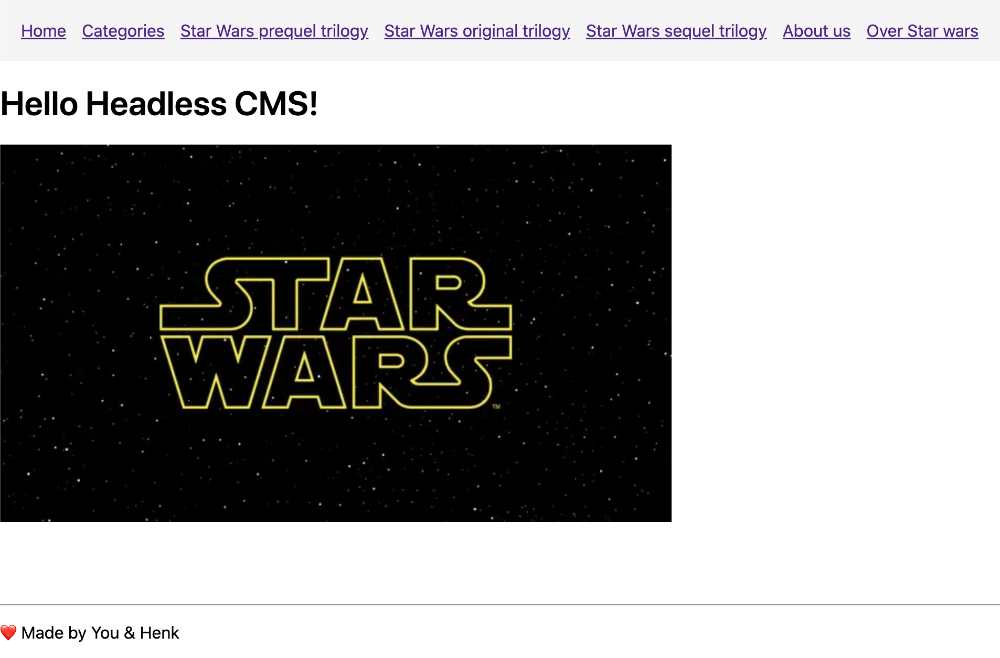
_Homepage_

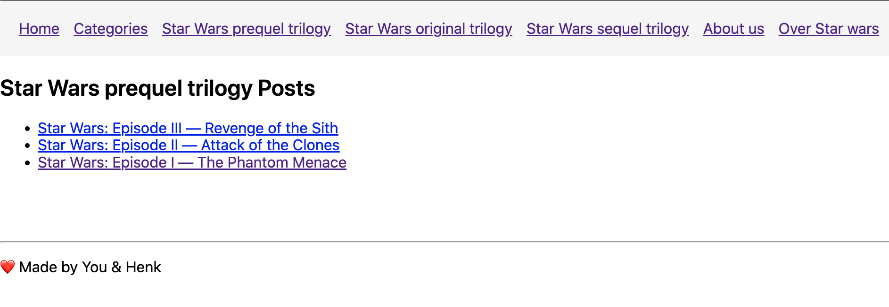
_Category page_

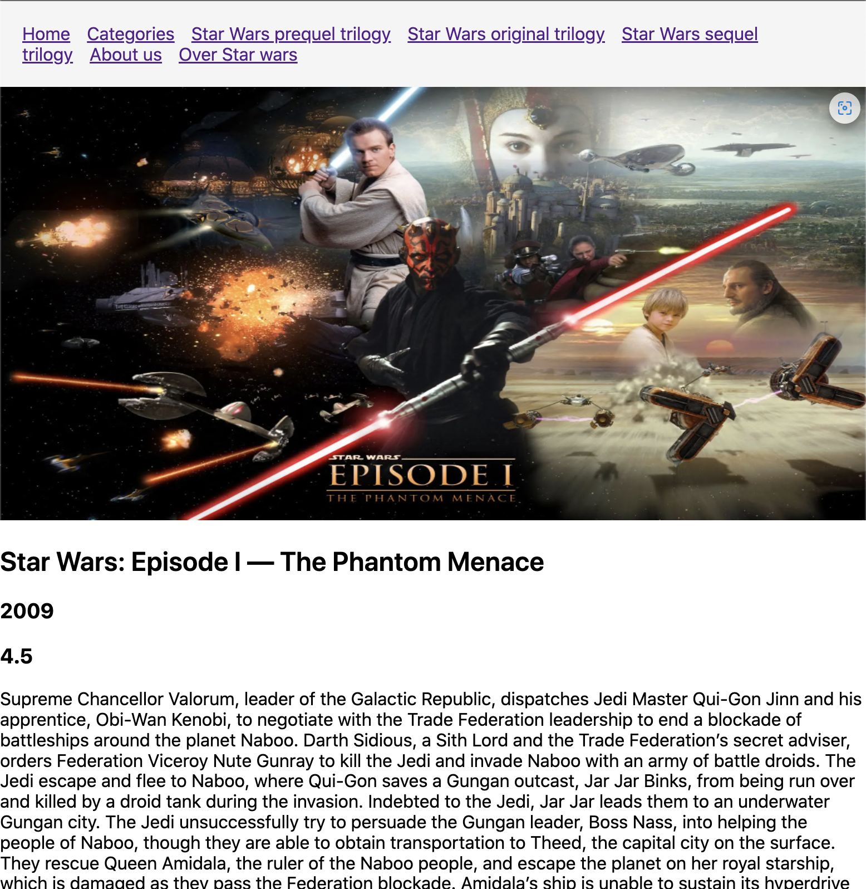
_Movie page_

## Onward

Okay, so now that we’ve established this awesome stack, let’s dive in!

```sh
git clone https://github.com/Quintor/headless-wordpress-workshop.git
```

> If you are stuck you can take a look a the result branch to continue

## Step One: Start the WordPress Installation

> New to Wordpress? [Read the Wordpress introduction](./wordpress-intro.md)

The following commands will get WordPress running on your machine using Docker, along with the WordPress plugins you'll need to create and serve custom data via the WP REST API.

```sh
cd wordpress
```

Start docker containers with docker compose

```sh
docker-compose up
```

> Having docker or docker-compose issues? Check [Docker troubleshooting](#docker-troubleshooting) if there is a possible solution

Once you have your new WordPress install set up, go ahead and visit your admin dashboard. The WordPress admin is available at <http://localhost:8081/wp-admin/> default login credentials `admin` / `Quintor!`


## Step Two: Sanity Check

Fire up your favorite API request tool (I like to use Postman) or a Terminal window if you prefer.

When the installation process completes successfully, the WordPress REST API is available at <http://localhost:8081/wp-json/>:

Git Bash or bash:

```sh
curl -H "Content-Type: application/json" http://localhost:8081/wp-json/wp/v2/posts/1?_embed
```

PowerShell:

```sh
$headers = New-Object "System.Collections.Generic.Dictionary[[String],[String]]"
$headers.Add("Accept", "application/json")

$response = Invoke-RestMethod 'http://localhost:8081/wp-json/wp/v2/posts/1?_embed' -Method 'GET' -Headers $headers
$response | ConvertTo-Json
```

> You can see the database with [phpMyAdmin](http://localhost:8080/). Login with user `root` and password `password`.

### List of WP endpoints

[Wordpress Rest API Handbook](https://developer.wordpress.org/rest-api)

- `/wp-json/wp/v2/posts?_embed` (list of all posts with images)
  - <https://developer.wordpress.org/rest-api/reference/posts/>
- `/wp-json/wp/v2/pages?_embed` (list of all pages with images)
  - <https://developer.wordpress.org/rest-api/reference/pages/>
- `/wp-json/wp/v2/categories` (list of all categories)
  - <https://developer.wordpress.org/rest-api/reference/categories/>
- `/wp-json/menus/v1/menus/header-menu`
  - will be explained later
- `/wp-json/headless/v1/post?slug=` (find single post by slug)
  - custom endpoint, see [./wordpress/wp-app/wp-content/themes/headless-wp/](./wordpress/wp-app/wp-content/themes/headless-wp/)
- `/wp-json/headless/v1/page?slug=` (find single post by slug)
  - custom endpoint, see [./wordpress/wp-app/wp-content/themes/headless-wp/](./wordpress/wp-app/wp-content/themes/headless-wp/)

## Step Three: React Frontend with NextJS

> New to React? [Read the React introduction](./react-intro.md)

There is a bare bones frontend project to start you off. In order to get it up and running use the following commands.

```sh
cd ../frontend
npm install
npm run dev
```

- This will start up a dev server on <http://localhost:3000>

### React with Typescript

> New to Typescript? [Read the Typescript introduction](./typescript-intro.md)

Documentation for how to use Typescript with React:

- [Typescript Handbook](https://www.typescriptlang.org/docs/home.html)
- [React Typescript Cheatsheet](https://react-typescript-cheatsheet.netlify.app/docs/basic/setup)
- [React & Redux in TypeScript](https://github.com/piotrwitek/react-redux-typescript-guide#react--redux-in-typescript---complete-guide)

### NextJS

> New to NextJS? [Read the NextJS introduction](./nextjs-intro.md)

Documentation:

- <https://nextjs.org/learn/>
- <https://nextjs.org/docs/getting-started>

### Supplied Components

We already prepared some react components for you to work with in the `frontend/components` folder. They will be used in the following way:

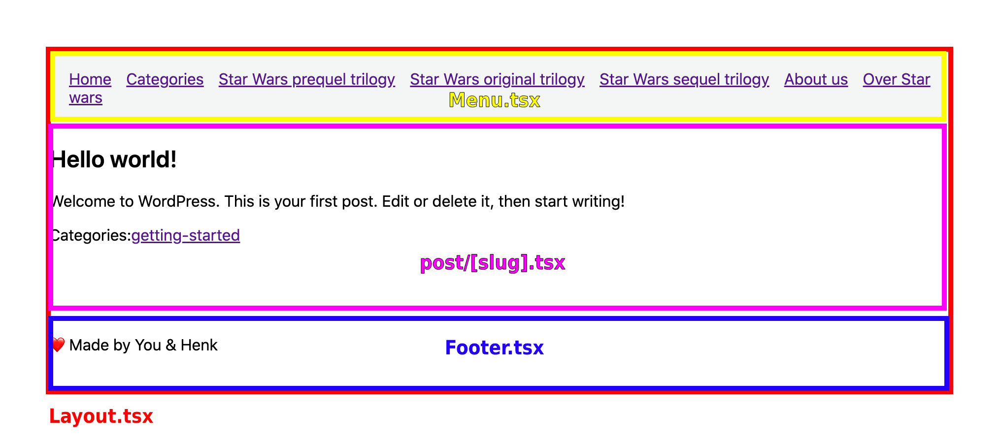

- `Footer.tsx` show credits
- `Header.tsx` add page metadata
- `Layout.tsx` base for all pages <https://nextjs.org/docs/basic-features/layouts>
- `Menu.tsx` show links
- `PostLink.tsx` helper to easier link to post page

### Listing Posts

To start off we will display a list of posts in the `index.tsx` component. Whatever you return from the [`getStaticProps`](https://nextjs.org/docs/basic-features/data-fetching/get-static-props) function is included in `props` in the component. There is an API service shell in `wordpress.service.ts` which will be expanded.

- Implement `getPosts` in `services/wordpress.service.ts`
  - There is an example implementation in `getMenu`
- Use the API service to return posts from `getStaticProps`
  - `await service.getPosts()`
  - add result to props
  - add posts type to `IOwnProps`
- Display the posts in a simple list:

  ```tsx
  ...
  const Home: NextPage<IProps> = (props) => {
    return (
      <Layout menu={props.menu}>
        <h1>{props.title}</h1>
        <Image src={starWarsLogo} alt="Star Wars Logo" />
        <ul>
          {props.posts.map(post => <li key={post.id}>{post.title.rendered}</li>)}
        </ul>
      </Layout>
    );
  };
  ...
  ```

## Step Four: Displaying Posts

Now that we have a list of posts on our main page, we want to be able to navigate to a page with further details. Create a `post/[slug].tsx` in de _pages_ folder. Paste the following code in this file:

```tsx
import { GetStaticPaths, GetStaticProps, NextPage } from "next";
import ErrorPage from "next/error";
import Head from "next/head";
import { useRouter } from "next/router";
import Layout from "../../components/Layout";
import { IMenuProps } from "../../components/Menu";
import { getMenu } from "../../services/menu.service";
import service from "../../services/wordpress.service";
import { IWpPost } from "../../types/post";

interface IOwnProps {
  post: IWpPost;
}

type IProps = IOwnProps & IMenuProps;

const Post: NextPage<IProps> = ({ post, menu }) => {
  const router = useRouter();

  if ((!router.isFallback && !post?.slug) || !post) {
    return <ErrorPage statusCode={404} />;
  }

  return (
    <Layout menu={menu}>
      <article>
        <Head>
          <title>{post.title.rendered} | Star Wars - WordPress + Next.JS</title>
          <meta
            property="og:image"
            content={post?._embedded?.["wp:featuredmedia"]?.[0]?.source_url}
          />
        </Head>
        <header>
          <h1>{post.title.rendered}</h1>
        </header>
        <section
          dangerouslySetInnerHTML={{
            __html: post.content.rendered,
          }}
        />
        <footer>
          {/* show categories*/}
        </footer>
      </article>
    </Layout>
  );
};

export default Post;

// This gets called at build time
export const getStaticProps: GetStaticProps<IProps> = async ({ params }) => {
  const menu = await getMenu();
  const post = await service.getPost(params?.slug);

  // Pass data data to the page via props
  return { props: { post, ...menu } };
};

export const getStaticPaths: GetStaticPaths = async ({}) => {
  const allPosts = await service.getPosts();

  return {
    paths: allPosts.map(({ slug }) => `/post/${slug}`) || [],
    fallback: true,
  };
};
```

- Implement the `getPost` method in the API service.
- The first parameter of `getStaticProps` is a context, this allowes you to get query string values through `context.query`.
- `getStaticPaths` will be explained when we setup pages.

### Improve posts on homepage with links

In `index.tsx` change your list items into links to this new page.

Example link, adjust this example to implement `post.slug` and `post.title.rendered`:

```ts
import Link from 'next/link';

  <Link
    href={"/post/post-slug"}
  >
    <a>My Post</a>
  </Link>
```

[`next/link` documentation](https://nextjs.org/docs/routing/introduction#linking-between-pages)

The link on the homepage should now open a page with the [hello-world post](http://localhost:3000/post/hello-world)

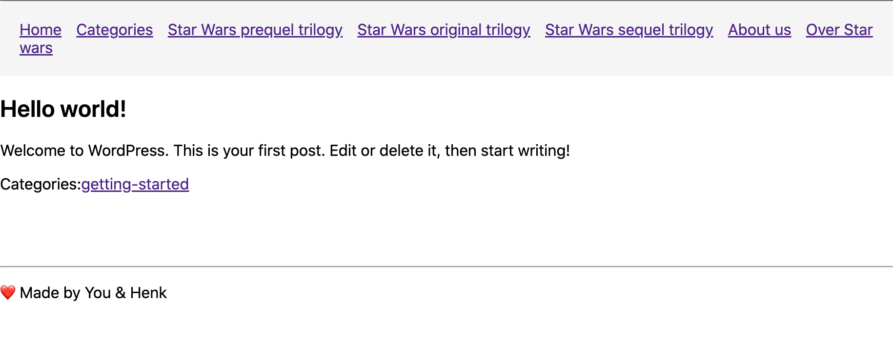
_You should see something like this_

## Step Five: Setup WP plugins for this project

The next thing to do is setup the plugins we’ll need for this awesome project. Go ahead and install these and then come back for the explanation of each.

### [CPT UI](https://wordpress.org/plugins/custom-post-type-ui/)

Custom Post Types (CPTs) is one of the most powerful features of WordPress. It allow you to create custom content types to go beyond the default Posts and Pages that WordPress ships with.

While it’s certainly possible (and pretty trivial) to create CPTs via PHP, I really like how easy CPT UI is to use. Plus, if you’re reading this with no prior WordPress experience, I’d rather you be able to focus on the WP-API itself instead of WordPress and PHP.

For our app, we’ll be creating a CPT called `Movies`.

We are going to cover how to add the `Movies` CPT, just import the data, go to [CPT UI>Tools](http://127.0.0.1:8081/wp-admin/admin.php?page=cptui_tools) and paste in the following file:

[./wordpress/import-data/cpt-movies-export.json](./wordpress/import-data/cpt-movies-export.json)

> If you want to manually add the `Movies` CPT [follow the manual guide](#manual-movies-cpt)

You should see a new Movies option appear in the sidebar:


### [Advanced Custom Fields](https://wordpress.org/plugins/advanced-custom-fields/)

Speaking in database terms, if CPTs are the tables, Custom Fields are the columns. This isn’t actually how WordPress stores CPTs and Custom Fields in its database, but I find this illustration helpful to those who have limited to no WordPress experience. CPTs are the resource (i.e. _“Movies”_) and Custom Fields are the metadata about that resource (i.e. _“Release Year, Rating, Description”_).

Advanced Custom Fields (ACF) is the plugin for WordPress Custom Fields. Of course, you can create Custom Fields with PHP (just like CPTs), but ACF is such a time-saver (and it's a GUI 😇).

Because the manual setup of ACF takes a while, we are going to use the import functionality 😉. Go to [Custom Fields>Tools](http://127.0.0.1:8081/wp-admin/edit.php?post_type=acf-field-group&page=acf-tools). You then import the following file: [./wordpress/import-data/acf-export-2022-03-17.json](./wordpress/import-data/acf-export-2022-03-17.json)

After the import you should see `Movie Data` in _Custom Fields_:

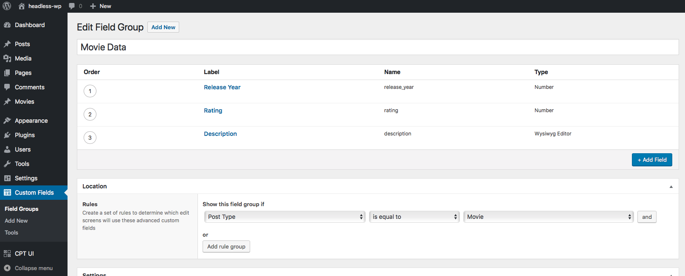

### [ACF to REST API](https://wordpress.org/plugins/acf-to-rest-api/)

Now that we have our Custom Fields, we need to expose them to the WP-API. ACF doesn’t currently ship with WP-API support, but there’s a great plugin solution from the community called ACF to REST API. All you have to do is install and activate it (we have done this for you 😉), and it will immediately expose your ACF custom fields to the API.

If we had created our Custom Fields directly via PHP (without the use of a plugin), there’s also a couple of nifty functions for exposing the field to the API. [More on that here](https://developer.wordpress.org/rest-api/extending-the-rest-api/modifying-responses/).

## Step Six: Post Data Import

First, we need to import all the Movies. Lucky for you, We already did all the manual work and all you have to do is import a nifty file. :-)

Go to [Tools>Import](http://127.0.0.1:8081/wp-admin/admin.php?import=wordpress). You should see a link to run the importer. Click that and import this file: [./wordpress/import-data/wp-movies-page.xml](./wordpress/import-data/wp-movies-page.xml).

The next screen will ask you to assign the imported posts to an author. You can just assign them to your default admin account and click Submit:

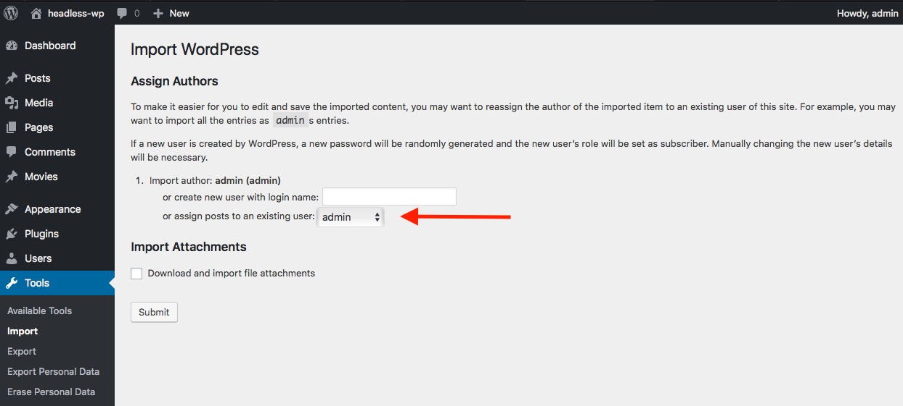

Lastly, go to [Movies>All Movies](http://127.0.0.1:8081/wp-admin/edit.php?post_type=movies). You should see a listing of Star Wars movies (Episodes 1–9)

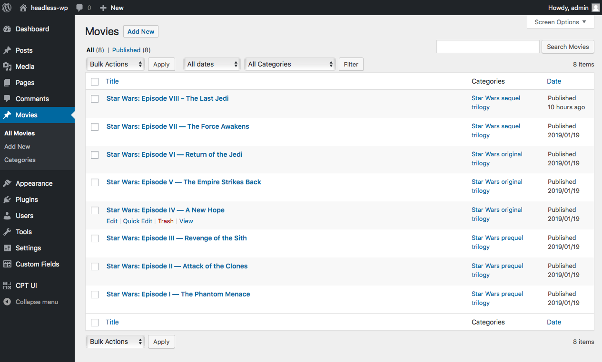

## Step Seven: Displaying Pages

Besides posts wordpress has the build-in content-type pages. Create a `page/[slug].tsx` in the pages directory, this page should display the details of a page. Follow the same method you did to implements posts.

**Tips**

- Implement the `getPages` and `getPage` method in the API service.

```tsx
// see post/[slug].tsx as example how to implement the page page ;)
...
// This gets called at build time
export const getStaticProps: GetStaticProps<IProps> = async ({ params }) => {
  const menu = await getMenu();
  const page = await service.getPage(params?.slug);

  // Pass data data to the page via props
  return { props: { page, ...menu } };
};

export const getStaticPaths: GetStaticPaths = async ({}) => {
  const allPages = await service.getPages();

  return {
    paths: allPages.map(({ slug }) => `/page/${slug}`) || [],
    fallback: true,
  };
};

```

What does the [`getStaticPaths`](https://nextjs.org/docs/basic-features/data-fetching/get-static-paths) do? When you export a function called `getStaticPaths` (Static Site Generation) from a page that uses dynamic routes, Next.js will statically pre-render all the paths specified by `getStaticPaths`.

### Create new page

Create a [new page in wordpress](http://127.0.0.1:8081/wp-admin/post-new.php?post_type=page). Add a block, eg. list, and publish the page. See the slug in the side menu:

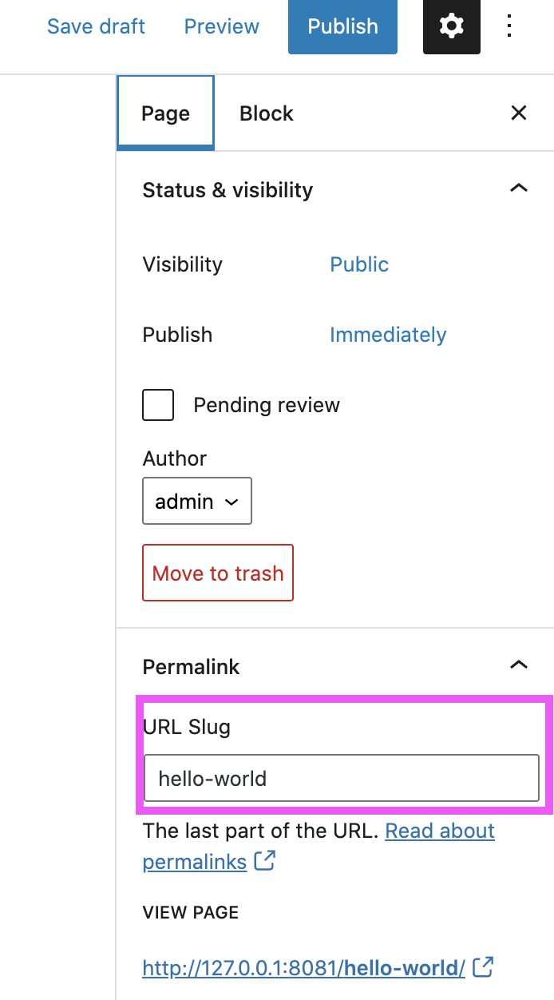

Use this slug to open the new page in the frontend eg.: <http://localhost:3000/page/hello-world>

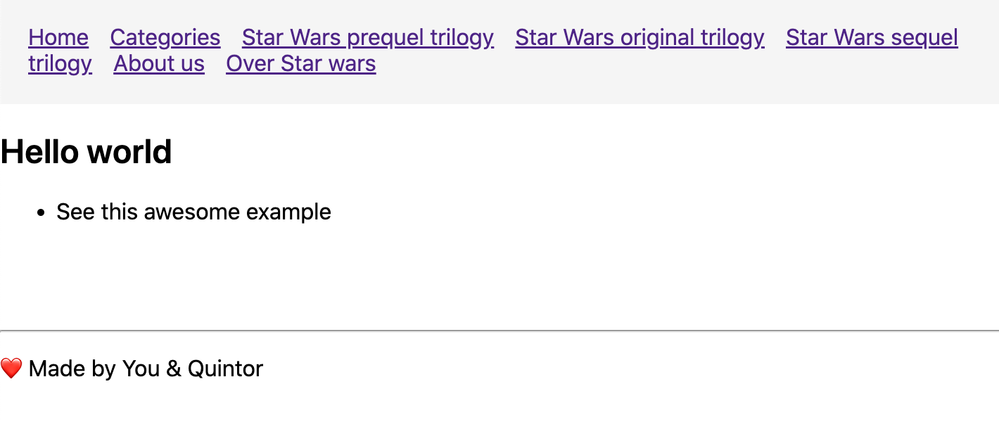

## Step Eight: Setup menu

This is the last step to get our WordPress installation ready to serve our Star Wars data.

We want our users enable to navigate through our awesome website. Luckily wordpress has us covered. Go to [Apprearance>Menus](http://127.0.0.1:8081/wp-admin/nav-menus.php).

To create menu manually add the pages _"About Us, Over star wars"_ to the menu. Next click on _"Categories"_ in the accordion and the the three Star wars categories to the menu. You should also check _"Header Menu"_ in _"Display location"_. Don't forget to save 😇!

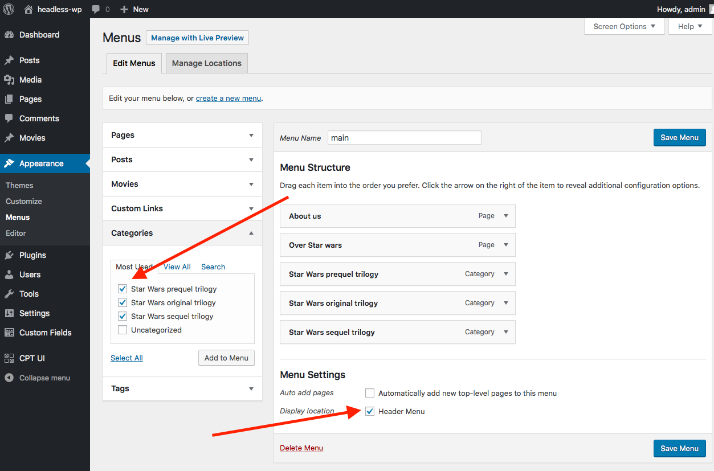

We should also check if the menu appears in the WP Rest API

```sh
curl -H "Content-Type: application/json" http://localhost:8081/wp-json/menus/v1/menus/header-menu
```

When you refresh the frontend you should see the menu items in the menu.

## Step Nine: Show posts and movies in a category

Create the follow page in the pages folder: `category/[slug].tsx`:

```tsx
import { GetStaticPaths, GetStaticProps, NextPage } from "next";
import ErrorPage from "next/error";
import { useRouter } from "next/router";
import Layout from "../../components/Layout";
import { IMenuProps } from "../../components/Menu";
import PostLink from "../../components/PostLink";
import { getMenu } from "../../services/menu.service";
import service from "../../services/wordpress.service";
import { IWpCategory } from "../../types/category";
import { IWpPost } from "../../types/post";

interface IOwnProps {
  category: IWpCategory;
}

type IProps = IOwnProps & IMenuProps;

const Category: NextPage<IProps> = ({ category, menu }) => {
  const router = useRouter();

  if ((!router.isFallback && !category?.slug) || !category) {
    return <ErrorPage statusCode={404} />;
  }

  return (
    <Layout menu={menu}>
      <section>
        <header>
          <h1>{category.name} Posts</h1>
        </header>
        <ul>{/* list posts*/}</ul>
      </section>
    </Layout>
  );
};

export default Category;

export const getStaticProps: GetStaticProps<IProps> = async ({ params }) => {
  const menu = await getMenu();
  const categories = await service.getCategories(params?.slug);
  const category = categories[0];

  return { props: { category, ...menu } };
};

export const getStaticPaths: GetStaticPaths = async ({}) => {
  const allCategories = await service.getCategories();

  return {
    paths: allCategories.map(({ slug }) => `/category/${slug}`) || [],
    fallback: true,
  };
};
```

Implement the `getCategory` in `wordpress.service.ts`.

Add `getCategories` to `wordpress.service.ts`:

```ts
public async getCategories(
  slugs: string | string[] = ""
): Promise<IWpCategory[]> {
  const slug = getSlug(slugs);
  const slugQS = `${slug ? `slug=${slug}` : ""}`;
  try {
    return fetchAPI(`/wp-json/wp/v2/categories?${slugQS}`);
  } catch (e) {
    return [];
  }
}
```

### List posts

Implement the `getTypeByCategory` in `wordpress.service.ts`:

```ts
public async getTypeByCategory(
  type: WpCategoryTypes,
  categoryId: number
): Promise<IWpPost[]> {
  return fetchAPI(`/wp-json/wp/v2/${type}?_embed&categories=${categoryId}`);
}
```

Add `posts: IWpPost[];` to `IOwnProps` in `category/[slug].tsx`

Add the following to the `Catogory` function:

```ts
const postList = posts.map((post) => (
  <li key={post.id}>
    <PostLink post={post} />
  </li>
  ));
```

replace `<ul>{/* list posts*/}</ul>` with `<ul>{postList}</ul>`

Add `const posts = await service.getTypeByCategory("posts", category.id);` to `getStaticProps` and add posts to the props.

This should show all the posts for a category. If you open a star wars category you see no posts. Thats because the movies are exposed on a different endpoint.

### List movies

Replace `const posts = await service.getTypeByCategory("posts", category.id);` with:

```ts
const moviesCat = service.getTypeByCategory("movies", category.id);
const postsCat = service.getTypeByCategory("posts", category.id);
const posts = (await Promise.all([moviesCat, postsCat])).flat();
```

This should fetch both posts and movies in parallel for a category. Now you should see the star wars movies in a category:


## Step Nine: Show a movie

Create the follow page in the pages folder: `movies/[slug].tsx`:

```tsx
import { GetStaticPaths, GetStaticProps, NextPage } from "next";
import { useRouter } from "next/router";
import Layout from "../../components/Layout";
import { IMenuProps } from "../../components/Menu";
import { getMenu } from "../../services/menu.service";
import { IWpPost } from "../../types/post";
import service from "../../services/wordpress.service";
import ErrorPage from "next/error";
import Head from "next/head";
import Image from "next/image";

interface IMovieModel {
  rating: string;
  release_year: string;
  description: string;
}

interface IOwnProps {
  movie: IWpPost<IMovieModel>;
}

type IProps = IOwnProps & IMenuProps;

const Movie: NextPage<IProps> = ({ movie, menu }) => {
  const router = useRouter();

  if ((!router.isFallback && !movie?.slug) || !movie) {
    return <ErrorPage statusCode={404} />;
  }

  const coverImage = movie?._embedded?.["wp:featuredmedia"]?.[0];

  return (
    <Layout menu={menu}>
      <article>
        <Head>
          <title>{movie.title.rendered} | Star Wars 🌌 - WordPress + Next.JS</title>
          <meta property="og:image" content={coverImage?.source_url} />
        </Head>
        <header>
          {coverImage && (
            <Image
              width={2000}
              height={1000}
              alt={`Cover Image for ${movie.title.rendered}`}
              src={coverImage.source_url}
            />
          )}
          <h1>{movie.title.rendered}</h1>
          <h3>{movie.acf.release_year}</h3>
          <h3>{movie.acf.rating}</h3>
        </header>
        <section
          dangerouslySetInnerHTML={{
            __html: movie.acf.description,
          }}
        />
      </article>
    </Layout>
  );
};

export default Movie;

export const getStaticProps: GetStaticProps<IProps> = async ({ params }) => {
  const menu = await getMenu();
  const movie = await service.getMovie<IMovieModel>(params?.slug);

  return { props: { movie, ...menu } };
};

export const getStaticPaths: GetStaticPaths = async ({}) => {
  const allMovies = await service.getMovies();

  return {
    paths: allMovies.map(({ slug }) => `/movies/${slug}`) || [],
    fallback: true,
  };
};
```

Implement the `getMovie` in `wordpress.service.ts`

```ts
public async getMovie<T = {}>(
  slugs: string | string[] = ""
): Promise<IWpPost<T>> {
  const slug = getSlug(slugs);
  const movies = await fetchAPI(`/wp-json/wp/v2/movies?_embed&slug=${slug}`);
  // querying all movies for slug, result is an array
  return movies[0];
}
```

Implement `getMovies` in `wordpress.service.ts`

When you open a movie you should see the following:


## Bonus Step: Link to categories on a post

Create a link to a category on a post page


**Tips**:

- add the categories page to the wordpress menu with a custom link: `/category`
- don't forget to query the `posts` and `movies` endpoints

## Bonus Step: Show categories overview

Create a category index which shows all the categories and there posts and movies

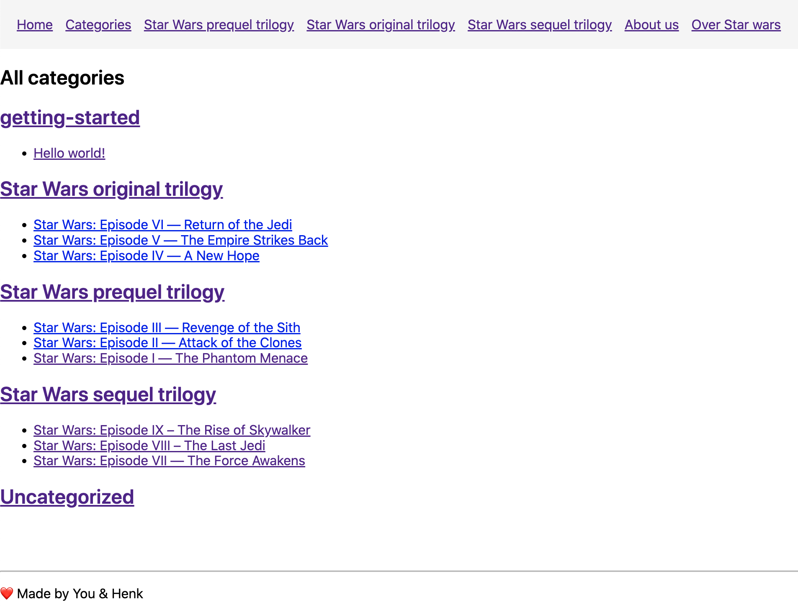

**Tips**:

- add the categories page to the wordpress menu with a custom link: `/category`
- don't forget to query the `posts` and `movies` endpoints

## Docker troubleshooting

## Docker hub mirror

> Note: As of November 1, 2020, [Docker Hub rate limits](https://www.docker.com/blog/scaling-docker-to-serve-millions-more-developers-network-egress/) apply to unauthenticated or authenticated pull requests on the Docker Free plan.

Possible errors:

- `context deadline exceeded`
-
-
-
-
- ```
  Error response from daemon: pull access denied for wordpress, repository does not exist or may require ‘docker login’:   
  denied: You have reached your pull rate limit. You may increase the limit by authenticating and upgrading: https://www.docker.com/increase-rate-limit
  ```

Add google cloud mirror to fix docker pull limit: <https://cloud.google.com/container-registry/docs/pulling-cached-images#docker-ui>

Restart docker and run `docker-compose pull` in the `wordpress` folder

### Windows & docker volumes

- If on a windows machine plugins aren't loaded in Wordpress, follow these steps:
  - Open Docker settings
  - Go to 'Shared Drives' tab
  - Click on 'Reset Credentials'
  - Select the drive you want to share
  - Click apply
  - Enter windows credentials

### Clean docker state

```sh
docker system prune --volumes -a
```

## Wordpress manual data

### Manual Movies CPT

We are going to cover how to manually add the `Movies` CPT.

The manual process:

1. Go to [CPT UI>Add/Edit Post Types](http://127.0.0.1:8081/wp-admin/admin.php?page=cptui_manage_post_types)
1. For the Post Type Slug, enter `movies`  —  this is the URL slug WordPress will use.
1. For the Plural Label, enter `Movies`
1. For the Singular Label, enter `Movie`
1. **IMPORTANT:** Scroll down to the Settings area and find the _“REST API base slug”_ option,  you should enter `movies` here.
1. Scroll all the way down and select `Categories (WP Core)` in _Built-in Taxonomies_
1. You can click Add Post Type.

You should see a new Movies option appear in the sidebar:


