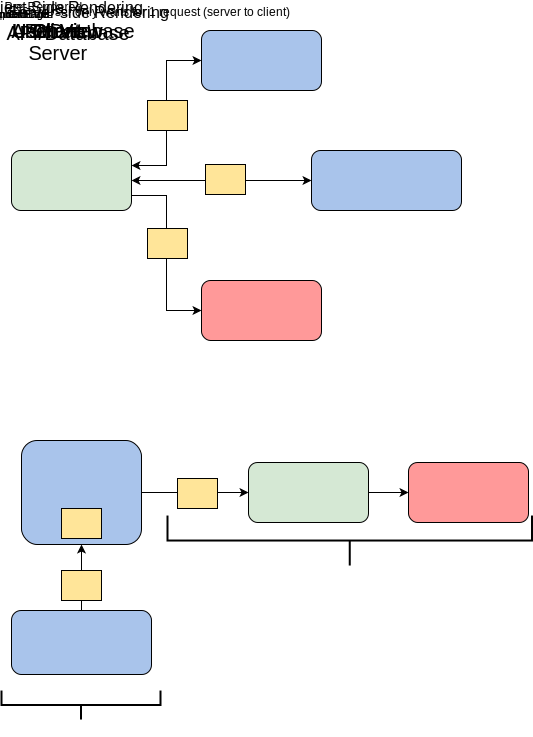

# NextJs Introduction

Next.js is an open-source React front-end framework that adds additional optimization capabilities like __server-side rendering__ (SSR) and __static-site generation__ (SSG). Next.js builds on the React library, meaning Next.js applications take the benefits of React and just adds additional features.

__Server Side Rendering__. _SSR_ allows the server to access all required data and process the JavaScript together to render the page. Then, the page is sent back in its entirety to the browser and immediately rendered. _SSR_ allows webpages to load in a fraction of the time and increases user experience with added responsiveness.

__Search Engine Optimization (SEO)__. Using _SSR_ also gives you an edge on SEO, which helps your site show up higher on search engine results pages. _SSR_ makes websites rank better for _SEO_ because they load faster and more of the site content can be scanned by _SEO_ trackers.

`<head>` tag. Next.js also allows you to edit the `<head>` tag of a site, which you cannot do in React. The `<head>` tag is a core part of a webpage’s metadata and contributes to the site’s _SEO_ ranking.

Overall, Next.js is considered to be a more fully-featured version of React that maintains the intuitiveness React Framework is known for.

## Why use Next.js?

The main advantage of Next.js is the built-in SSR support for increased performance and SEO. Server-side rendering works by altering the request flow of the React application such that all components except the client send their info to the server.

With all info on the server, it can pre-render the HTML of the page. The client can send a single request to the server and receive the full HTML page rather than requesting each component individually with client-side rendering.

__Pros__:

- Next.js apps load considerably faster than React apps due to out-of-the-box server-side rendering.
- Supports static-site export features.
- Quick to learn for anyone with previous React experience.
- Automatic code splitting for pages.
- Easily to build internal APIs through built-in API routes and create API endpoints.
- Built-in support for page routing, CSS, JSX, and TypeScript.
- Quick to add plugins to customize Next.js to your specific page’s needs.
- Maintains the benefits of React such as intuitive component-driven creation, front-end state system, and high popularity.

__Con__:

The only real downside of Next.js is that it’s an opinionated framework, meaning it has a specific method and toolset that it wants you to use to construct your apps.

## When to use Next.js

Next.js is best suited for making an optimized landing or homepage as well as any other pages that rely on organic search traffic. These pages will see the most benefit from SEO improvements of Next.js.

Next.js is also better for websites than web apps as SSR allows it to have the same performance regardless of the device the client is using.

Next.js is less ideal for creating web applications or secured applications that require authentication because these do not benefit server-side rendering.

More information:

- <https://nextjs.org/learn/foundations/about-nextjs>
- <https://langvad.dev/blog/an-introduction-to-nextjs/>
