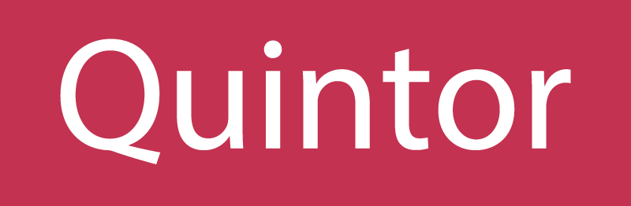
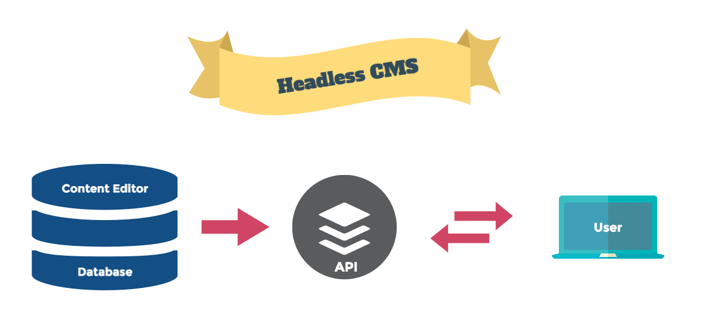
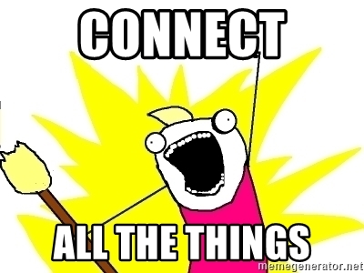
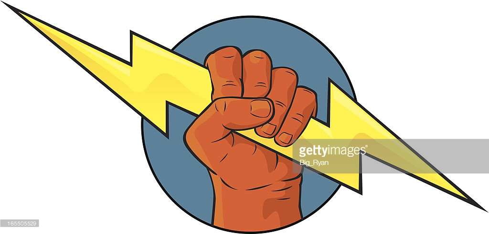

<!-- .slide: data-background="./images/home.png", data-background-transition="slide", class="title_page" -->

# The Power of Headless CMS

---

## Even voorstellen 🤝

#### Henk Bakker

<div class="columns two">
  <div class="left">
    
  </div>
  <div class="right">
    <ul>
      <li>Consultant @ Quintor</li>
      <li>Twitter: <a href="https://twitter.com/spike1292">@spike1292</a></li>
      <li>Email: <a href="mailto:h.bakker@quintor.nl">h.bakker@quintor.nl</a></li>
    </ul>
  </div>
</div>

---



<div class="columns two">
  <div class="left">
    <ul>
      <li>Java</li>
      <li>.Net</li>
      <li>Frontend</li>
      <li>Platform Engineering</li>
      <li>Security</li>
      <li>Informatie Analyse</li>
    </ul>

  </div>
  <div class="right">
     <ul>
      <li>Den Haag</li>
      <li>Den Bosch</li>
      <li>Amersfoort</li>
      <li>Deventer</li>
      <li>Groningen</li>
    </ul>
  </div>
</div>
<br/>
<a href="https://quintor.nl/">https://quintor.nl/</a>

---


- Minor Cloud-Native Software Development
  - <https://quintor.nl/minors/>
- Afstuderen bij Quintor
  - <https://quintor.nl/student/>
- Young Professional Programma
  - <https://quintor.nl/young-professional/>

---

## Programma

- Theorie
- Demo
- Hands-on opdracht

---

## Even handjes in de modder 👌

Code: <https://github.com/quintor/headless-wordpress-workshop>

```sh
git clone https://github.com/quintor/headless-wordpress-workshop.git

# wordpress docker
cd ./headless-wordpress-workshop/wordpress
docker-compose up

cd ../frontend
npm install
```

---

<!-- .slide: data-background="./images/cms-background.jpg", data-background-transition="slide" class="dark-background dark-overlay" -->

# CMS

---

## What does a CMS do?

| Content management                   | Content Delivery <!-- .element: class="fragment" data-fragment-index="1" -->                                             | Content presenation <!-- .element: class="fragment" data-fragment-index="2" -->                                                          |
| ------------------------------------ | ------------------------------------------------------------------------------------------------------------------------ | ---------------------------------------------------------------------------------------------------------------------------------------- |
| Creation and organization of content | Delivery of content and presentation to one or more channels <!-- .element: class="fragment" data-fragment-index="1" --> | <!-- .element: class="fragment" data-fragment-index="2" --> The **rendering** of the content and presentation on one or multiple devices |

---

## Headless?



Note:
Enkele notities bij de introductie pagina zichtbaar in de presenter view

---

> Can you use a "regular" CMS as a "headless" CMS?

No problem most CMS's like Drupal or Wordpress also support a headless approach <!-- .element: class="fragment" data-fragment-index="1" -->

For example: <!-- .element: class="fragment" data-fragment-index="1" --> [Headless drupal](https://www.drupal.org/association/supporters/blog/implementation-guide-on-headless-and-decoupled-cms) <!-- .element: class="fragment" data-fragment-index="1" -->

---

<!-- .slide: data-background="./images/devices-background-1.jpg", data-background-transition="slide" class="dark-background dark-overlay" -->

# Devices

---

<!-- .slide: class="center-img" -->


---

<!-- .slide: class="center-img" -->



---

<!-- .slide: data-background="./images/sitecore-background.jpg", data-background-transition="slide" class="dark-background dark-overlay" -->

# Wordpress

---

<!-- .slide: class="center-img" -->


---

<!-- .slide: class="center-img" -->

> &ldquo;WordPress is used by 64.8% of all the websites whose content management system we know. This is 43.1% of all websites.&rdquo;

<https://w3techs.com/technologies/details/cm-wordpress/all/all>

---

<!-- .slide: class="center-img" -->

## The new editor


Written in react 😉 <!-- .element: class="fragment" -->

---

<!-- .slide: class="center-img" -->

## Wordpress Architecture


---

<!-- .slide: class="center-img" -->

## Wordpress Headless


---

<!-- .slide: data-background="./images/frontend-background.jpg", data-background-transition="slide" class="dark-background dark-overlay" -->

# Front-end

---

## Choose **your** framework

|  |  |  |
| :------------------------------------------: | :----------------------------------------: | :--------------------------------------: |
|                   Angular                    |                   React                    |                   Vue                    |

---

## Power to the front-end developer! ⚡️



---

<!-- .slide: data-background="./images/demo-background.jpg", data-background-transition="slide" class="dark-background dark-overlay" -->

# Demo Time

---

## The stack

|  |  |  |  |
| :-----------------------------------------------------: | :--------------------------------------------------------: | :----------------------------------------------------: | :------------------------------------------------------: |
|                         Docker                          |                         Wordpress                          |                         React                          |                         Next.js                          |

<a href="<<<<http://localhost:3000>>>>" target="_blank">http://localhost:3000</a>

---

<!-- .slide: data-background="./images/keyboard_dark.jpg", data-background-transition="slide" class="dark-background" -->

# Hands-on

---

## En nu aan het werk ⌨️

### <a href="https://github.com/quintor/headless-wordpress-workshop" target="_blank">Opdrachten</a>

---

<!-- .slide: data-background="./images/rocks-background.jpg", data-background-transition="slide" class="dark-background dark-overlay" -->

# Headless Wordpress Rocks

---

<!-- .slide: data-background="./images/skyline_dark.png", data-background-transition="slide"  class="dark-background dark-overlay" -->

# Vragen?
