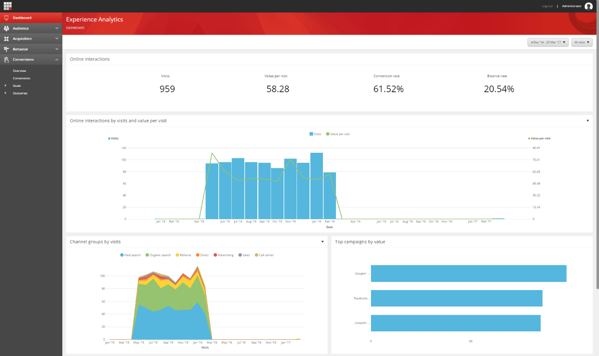
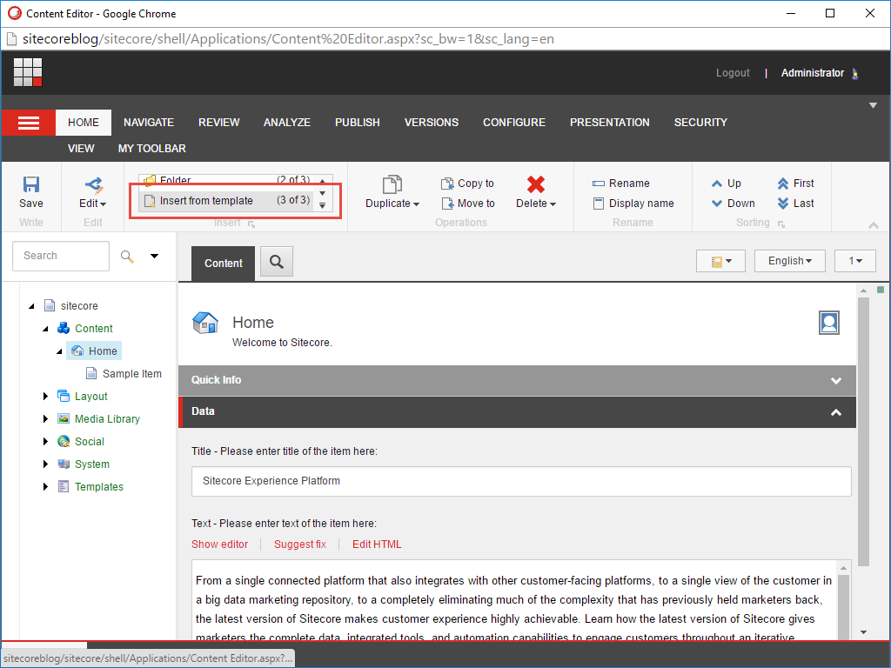
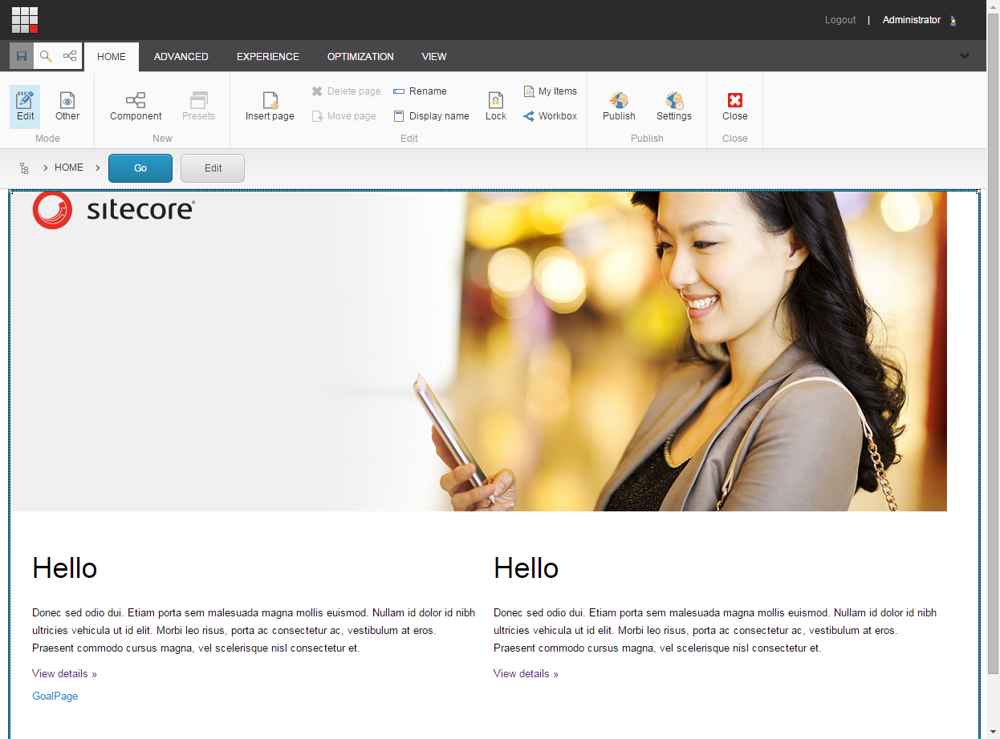
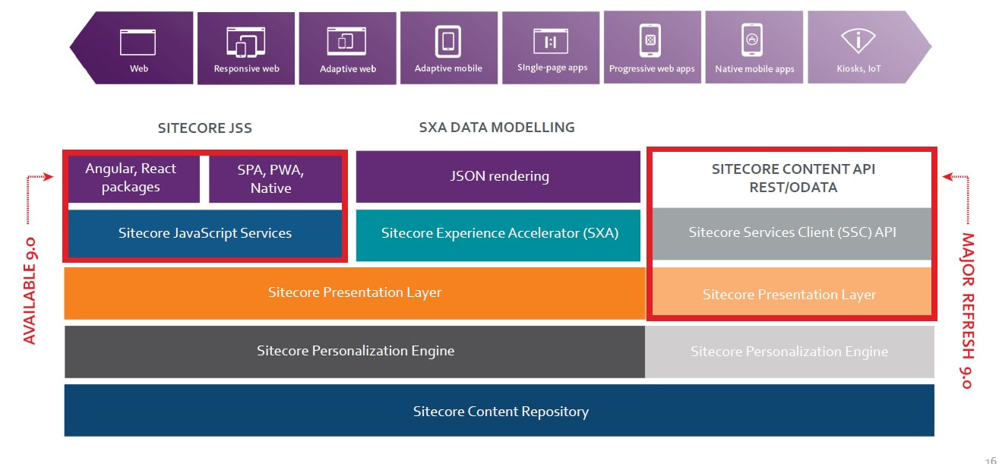
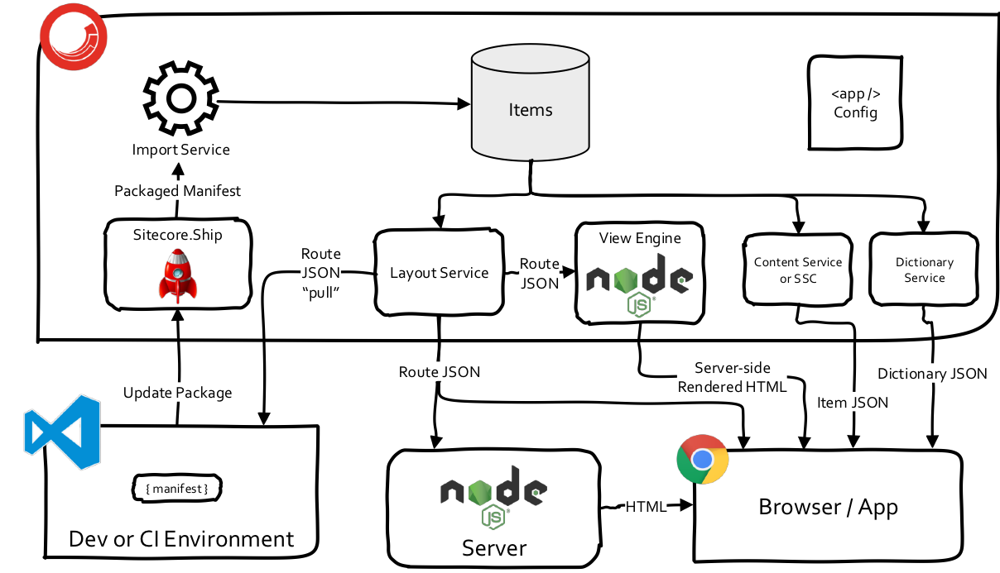

<!-- .slide: data-background="./images/skyline_light.jpg", data-background-transition="slide" -->
<!-- .slide: data-background="./images/skyline_dark.png", data-background-transition="slide" -->

<br>
# The Power of Headless CMS

---

## Even voorstellen 🤝

<br>

|  |  |
| :---------------------------------------: | :--------------------------------------: |
|               David Sherman               |               Henk Bakker                |

--

## Even handjes in de modder 👌

Presentatie: <http://headless-cms.quintor.info/>

Code: <a href="https://git.quintor.nl/staq/quintor-handson-sessies/tree/headless-cms" target="_blank">Quintor Gitlab</a>

Op login pagina selecteer _Standaard_

|          |                 |
| -------- | --------------- |
| Username | <b>staquser</b> |
| Password | <b>staquser</b> |

```sh
git clone https://git.quintor.nl/staq/quintor-handson-sessies.git
cd quintor-handson-sessies
git checkout headless-cms
git pull

cd assignment
yarn install # or npm install
```

---

<!-- .slide: data-background="./images/cms-background.jpg", data-background-transition="slide" -->

<br><br>

# CMS <!-- .element: class="bg" -->

--

## What does a CMS do?

| Content management                   | Content Delivery <!-- .element: class="fragment" data-fragment-index="1" -->                                             | Content presenation <!-- .element: class="fragment" data-fragment-index="2" -->                                                          |
| ------------------------------------ | ------------------------------------------------------------------------------------------------------------------------ | ---------------------------------------------------------------------------------------------------------------------------------------- |
| Creation and organization of content | Delivery of content and presentation to one or more channels <!-- .element: class="fragment" data-fragment-index="1" --> | <!-- .element: class="fragment" data-fragment-index="2" --> The **rendering** of the content and presentation on one or multiple devices |

--

## Headless?!


Note:
Enkele notities bij de introductie pagina zichtbaar in de presenter view

--

> Can you use a "regular" CMS as a "headless" CMS?

No problem most CMS like Drupal or Wordpress also support a headless approach <!-- .element: class="fragment" data-fragment-index="1" -->

For example <!-- .element: class="fragment" data-fragment-index="1" --> [Headlesss Wordpress with React](https://dev.to/jchiatt/headless-wordpress-with-react) <!-- .element: class="fragment" data-fragment-index="1" -->

---

<!-- .slide: data-background="./images/devices-background-1.jpg", data-background-transition="slide" -->

<br><br>

# Devices <!-- .element: class="bg" -->

--

<!-- .slide: class="center-img" -->


--

<!-- .slide: class="center-img" -->


---

<!-- .slide: data-background="./images/sitecore-background.jpg", data-background-transition="slide" -->

<br><br>

# Sitecore <!-- .element: class="bg" -->

--

<!-- .slide: class="center-img" -->


--

<!-- .slide: class="center-img" -->


--

<!-- .slide: class="center-img" -->


---

<!-- .slide: class="center-img" -->

## Sitecore Headless



---

<!-- .slide: class="center-img" -->

## Sitecore JSS



---

<!-- .slide: data-background="./images/components-background.jpg", data-background-transition="slide" -->

<br><br>

# Components <!-- .element: class="bg" -->

--

<!-- .slide: class="center-img" -->

## Everything is a component


---

<!-- .slide: data-background="./images/frontend-background.jpg", data-background-transition="slide" -->

<br><br>

# Front-end

--

## Choose **your** framework

|  |  |  |
| :------------------------------------------: | :----------------------------------------: | :--------------------------------------: |
|                   Angular                    |                   React                    |                   Vue                    |

--

## Power to the front-end developer! ⚡️


---

<!-- .slide: data-background="./images/demo-background.jpg", data-background-transition="slide" -->

<br><br>

# Demo Time! <!-- .element: class="bg" -->

--

## Essent Proof of Concept 🦄

<a href="https://innogy-sc-essent-test-239380-single.azurewebsites.net" target="_blank">Essent Proof of Concept</a>

<a href="https://innogy-sc-essent-test-239380-single.azurewebsites.net/en?sc_mode=edit" target="_blank">Sitecore experience editor</a>

---

<!-- .slide: data-background="./images/keyboard_light.jpg", data-background-transition="slide" -->
<!-- .slide: data-background="./images/keyboard_dark.jpg", data-background-transition="slide" -->

<br><br>

# Hands-on

---

## En nu aan het werk 🔥

### <a href="https://git.quintor.nl/staq/quintor-handson-sessies/tree/headless-cms/assignment" target="_blank">Opdrachten</a>

---

## Assignment 1 - Exploration

Explore the website, look through the code files.

Change the values in content pages (`/data/routes`), make changes in components (`/src/app/components`) and see all these changes be reflected in the website!

---

## Assignment 2 - Jumbotron

In `/src/app/components` you can find the Jumbotron component, we're going to adjust the Jumbotron to fit our needs.

---

## Assignment 3 - Placeholders

Placeholders are a core concept in Sitecore: a placeholer is like a container in which you can put any kind of component. You can define a placeholder in a manifest like this:

```typescript
manifest.addComponent({
    name: 'Component',
    displayName: 'Display Name',
    fields: [
        ... fields ...
    ],
    placeholders: [
        { name: 'a-placeholder' },
    ],
});
```

---

## Assignment 4 - Your own component

Build your own component from start to finish! You can do anything you want, you have 15 minutes for this!

---

## Assignment 5 - The final destination

Create a content `blocks component` in which you can have different `content block` components (using placeholders), and those `content block` components can different smaller components defined in them (using placeholders). Create these smaller components:

- Title text component
- Intro text (rich text) component
- Photo component
- Button component

---

## Assignment 6 - Bonus ✨

Build a pricing component with [Angular Material](https://material.angular.io/components/categories).

Some inspiraction for a pricing component

- <a href="https://codepen.io/renanpupin/pen/EVWgyP" target="_blank">CodePen</a>

---

<!-- .slide: data-background="./images/rocks-background.jpg", data-background-transition="slide" -->

<br><br>

# Headless CMS Rocks! <!-- .element: class="bg" -->

---

<!-- .slide: data-background="./images/skyline_light.jpg", data-background-transition="slide" -->
<!-- .slide: data-background="./images/skyline_dark.png", data-background-transition="slide" -->

<br>
# Vragen?
