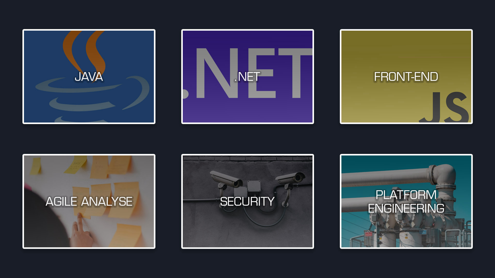
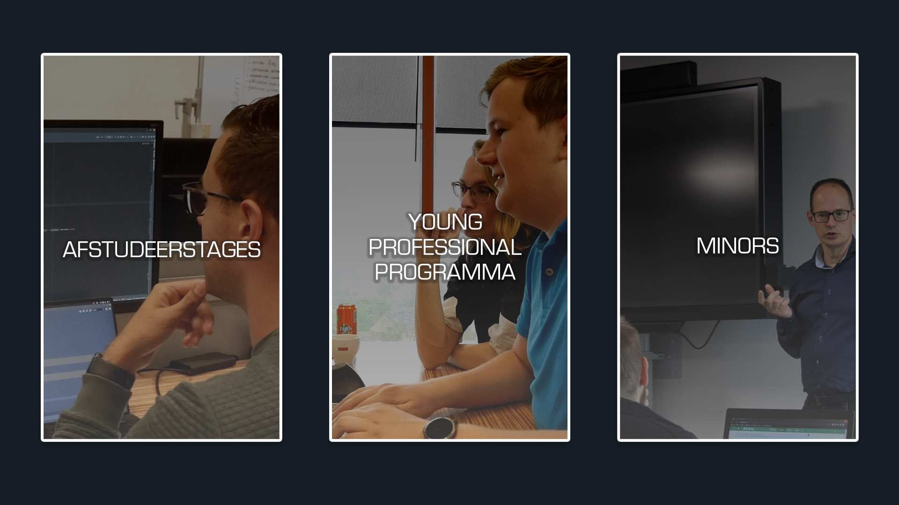
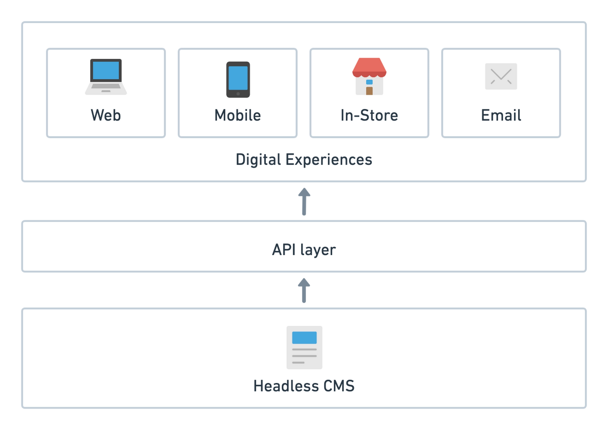
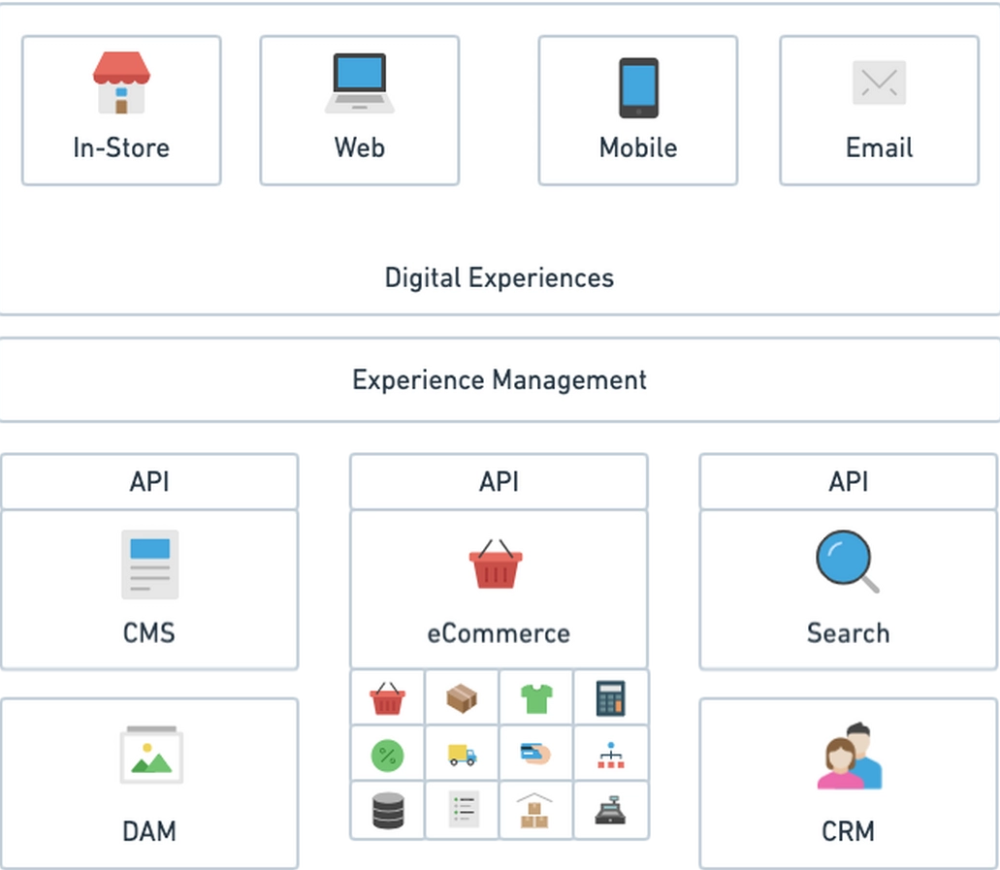
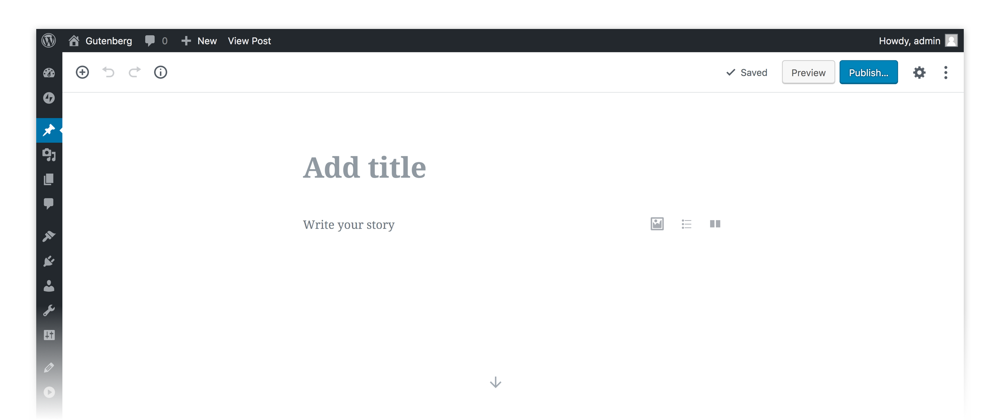
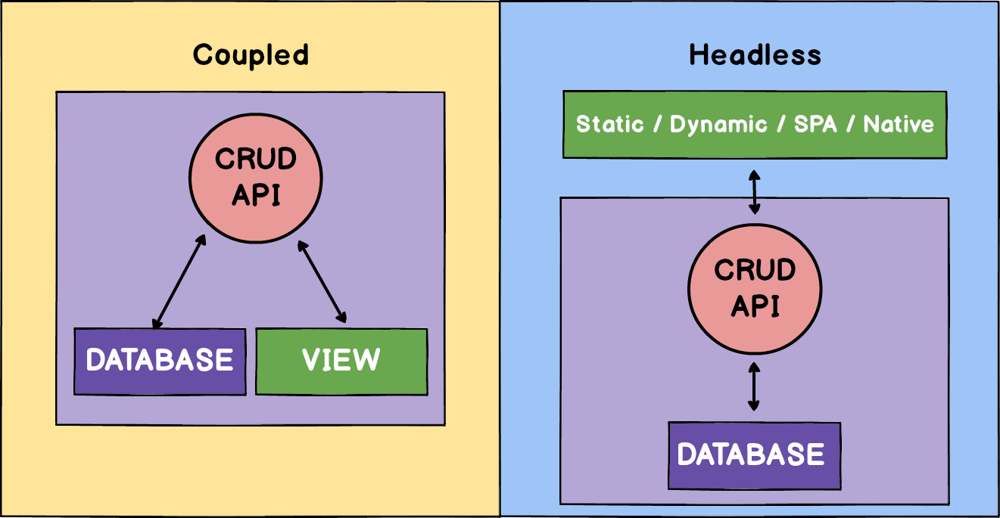
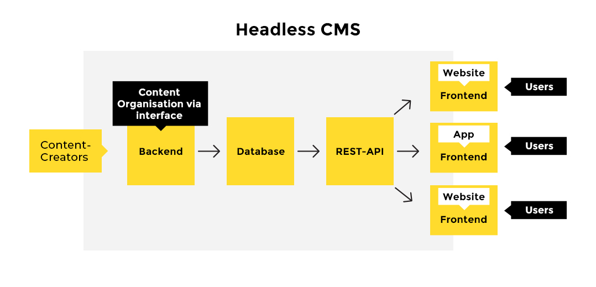

<!-- .slide: data-background="./images/home.png", data-background-transition="slide", class="title_page" -->

# The Power of Headless CMS

---

## Even voorstellen 🤝

#### Henk Bakker

  

    
  

  

    <ul>
      <li>Consultant @ Quintor</li>
      <li>Twitter: <a href="https://twitter.com/spike1292">@spike1292</a></li>
      <li>Email: <a href="mailto:h.bakker@quintor.nl">h.bakker@quintor.nl</a></li>
    </ul>
  

---

<!-- .slide: class="center-img quintor-background" data-background-color="#181D27" -->

https://quintor.nl/

---

<!-- .slide: class="center-img quintor-background" data-background-color="#181D27" -->

https://quintor.nl/student/

---

## Programma

- Intro
- Demo
- Hands-on opdracht

---

<!-- .slide: data-background="./images/cms-background.jpg", data-background-transition="slide" class="dark-background dark-overlay" -->

# CMS

---

## What does a CMS do?

| Content management                   | Content Delivery <!-- .element: class="fragment" data-fragment-index="1" -->                                             | Content presenation <!-- .element: class="fragment" data-fragment-index="2" -->                                                          |
| ------------------------------------ | ------------------------------------------------------------------------------------------------------------------------ | ---------------------------------------------------------------------------------------------------------------------------------------- |
| Creation and organization of content | Delivery of content and presentation to one or more channels <!-- .element: class="fragment" data-fragment-index="1" --> | <!-- .element: class="fragment" data-fragment-index="2" --> The **rendering** of the content and presentation on one or multiple devices |

---

## Headless?

---

> Can you use a "regular" CMS as a "headless" CMS?

No problem most CMS's like Drupal or Wordpress also support a headless approach <!-- .element: class="fragment" data-fragment-index="1" -->

For example: <!-- .element: class="fragment" data-fragment-index="1" --> [Headless drupal](https://www.drupal.org/association/supporters/blog/implementation-guide-on-headless-and-decoupled-cms) <!-- .element: class="fragment" data-fragment-index="1" -->

---

## MACH?

**M**icroservices **A**PI-first **C**loud-native **H**eadless

---

<!-- .slide: data-background="./images/sitecore-background.jpg", data-background-transition="slide" class="dark-background dark-overlay" -->

# Wordpress

---

<!-- .slide: class="center-img" -->

> &ldquo;WordPress is used by 64.8% of all the websites whose content management system we know. This is 43.1% of all websites.&rdquo;

<https://w3techs.com/technologies/details/cm-wordpress/all/all>

---

<!-- .slide: class="center-img" -->

## The new editor

Written in react 😉 <!-- .element: class="fragment" -->

---

<!-- .slide: class="center-img" -->

## Wordpress Architecture

---

<!-- .slide: class="center-img" -->

## Wordpress Headless

---

<!-- .slide: data-background="./images/frontend-background.jpg", data-background-transition="slide" class="dark-background dark-overlay" -->

# Front-end

---

<!-- .slide: data-background="./images/demo-background.jpg", data-background-transition="slide" class="dark-background dark-overlay" -->

# Demo Time

---

<!-- .slide: data-background="./images/rocks-background.jpg", data-background-transition="slide" class="dark-background dark-overlay" -->

# Headless Wordpress Rocks

---

<!-- .slide: data-background="./images/skyline_dark.png", data-background-transition="slide"  class="dark-background dark-overlay" -->

# Vragen?

---

<!-- .slide: data-background="./images/keyboard_dark.jpg", data-background-transition="slide" class="dark-background" -->

# Hands-on

---

## En nu aan het werk ⌨️

#### <a href="https://github.com/quintor/headless-wordpress-workshop" target="_blank">https://github.com/quintor/headless-wordpress-workshop</a>

> Gebruik `git` en niet de github download knop 😉
