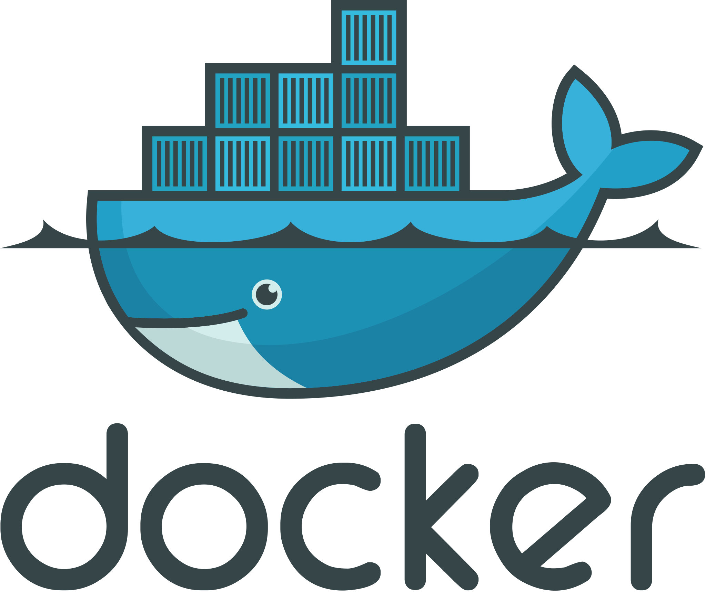

<!-- .slide: data-background="./images/skyline_light.jpg", data-background-transition="slide" -->
<!-- .slide: data-background="./images/skyline_dark.png", data-background-transition="slide" -->

<br>
# The Power of Headless CMS

---

## Even voorstellen 🤝

<br>

|  |  |
| :---------------------------------------: | :--------------------------------------: |
|               David Sherman               |               Henk Bakker                |

--

## Even handjes in de modder 👌

Wifi: QuintorGast / 0651493826

Code: <a href="https://git.quintor.nl/frontend-masterclass/wordpress" target="_blank">Quintor Gitlab</a>

Op login pagina selecteer _Standaard_

|          |                 |
| -------- | --------------- |
| Username | <b>staquser</b> |
| Password | <b>staquser</b> |

```sh
git clone https://git.quintor.nl/frontend-masterclass/wordpress.git

# wordpress docker
cd ./wordpress/wordpress
docker-compose up

cd ../frontend
npm install
```

---

<!-- .slide: data-background="./images/cms-background.jpg", data-background-transition="slide" -->

<br><br>

# CMS <!-- .element: class="bg" -->

--

## What does a CMS do?

| Content management                   | Content Delivery <!-- .element: class="fragment" data-fragment-index="1" -->                                             | Content presenation <!-- .element: class="fragment" data-fragment-index="2" -->                                                          |
| ------------------------------------ | ------------------------------------------------------------------------------------------------------------------------ | ---------------------------------------------------------------------------------------------------------------------------------------- |
| Creation and organization of content | Delivery of content and presentation to one or more channels <!-- .element: class="fragment" data-fragment-index="1" --> | <!-- .element: class="fragment" data-fragment-index="2" --> The **rendering** of the content and presentation on one or multiple devices |

--

## Headless?!


Note:
Enkele notities bij de introductie pagina zichtbaar in de presenter view

--

> Can you use a "regular" CMS as a "headless" CMS?

No problem most CMS's like Drupal or Wordpress also support a headless approach <!-- .element: class="fragment" data-fragment-index="1" -->

For example: <!-- .element: class="fragment" data-fragment-index="1" --> [Headless drupal](https://www.drupal.org/association/supporters/blog/implementation-guide-on-headless-and-decoupled-cms) <!-- .element: class="fragment" data-fragment-index="1" -->

---

<!-- .slide: data-background="./images/devices-background-1.jpg", data-background-transition="slide" -->

<br><br>

# Devices <!-- .element: class="bg" -->

--

<!-- .slide: class="center-img" -->


--

<!-- .slide: class="center-img" -->


---

<!-- .slide: data-background="./images/sitecore-background.jpg", data-background-transition="slide" -->

<br><br>

# Wordpress <!-- .element: class="bg" -->

--

<!-- .slide: class="center-img" -->


--

<!-- .slide: class="center-img" -->

> &ldquo;WordPress is used by 59.9% of all the websites whose content management system we know. This is 32.9% of all websites.&rdquo;

<https://w3techs.com/technologies/details/cm-wordpress/all/all>

--

<!-- .slide: class="center-img" -->

## The brand new editor


---

<!-- .slide: class="center-img" -->

## Wordpress Headless


---

<!-- .slide: data-background="./images/components-background.jpg", data-background-transition="slide" -->

<br><br>

# Components <!-- .element: class="bg" -->

--

<!-- .slide: class="center-img" -->

## Everything is a component


---

<!-- .slide: data-background="./images/frontend-background.jpg", data-background-transition="slide" -->

<br><br>

# Front-end

--

## Choose **your** framework

|  |  |  |
| :------------------------------------------: | :----------------------------------------: | :--------------------------------------: |
|                   Angular                    |                   React                    |                   Vue                    |

--

## Power to the front-end developer! ⚡️


---

<!-- .slide: data-background="./images/demo-background.jpg", data-background-transition="slide" -->

<br><br>

# Demo Time! <!-- .element: class="bg" -->

--

<!-- .slide: data-background="#fff" -->

## The stack

|  |  |  |  |
| :-----------------------------------------------------: | :--------------------------------------------------------: | :----------------------------------------------------: | :------------------------------------------------------: |
|                         Docker                          |                         Wordpress                          |                         React                          |                         Next.js                          |

<a href="http://localhost:3000" target="_blank">http://localhost:3000</a>

--

<!-- .slide: class="center-img" -->

## Essent Proof of Concept 🦄

<a href="https://prd-ssr-essent-de-open-consument.innogynederland.nl" target="_blank"></a>

---

<!-- .slide: data-background="./images/keyboard_light.jpg", data-background-transition="slide" -->
<!-- .slide: data-background="./images/keyboard_dark.jpg", data-background-transition="slide" -->

<br><br>

# Hands-on

---

## En nu aan het werk 🔥

### <a href="https://git.quintor.nl/frontend-masterclass/wordpress" target="_blank">Opdrachten</a>

---

<!-- .slide: data-background="./images/rocks-background.jpg", data-background-transition="slide" -->

<br><br>

# Headless CMS Rocks! <!-- .element: class="bg" -->

---

<!-- .slide: data-background="./images/skyline_light.jpg", data-background-transition="slide" -->
<!-- .slide: data-background="./images/skyline_dark.png", data-background-transition="slide" -->

<br>
# Vragen?
